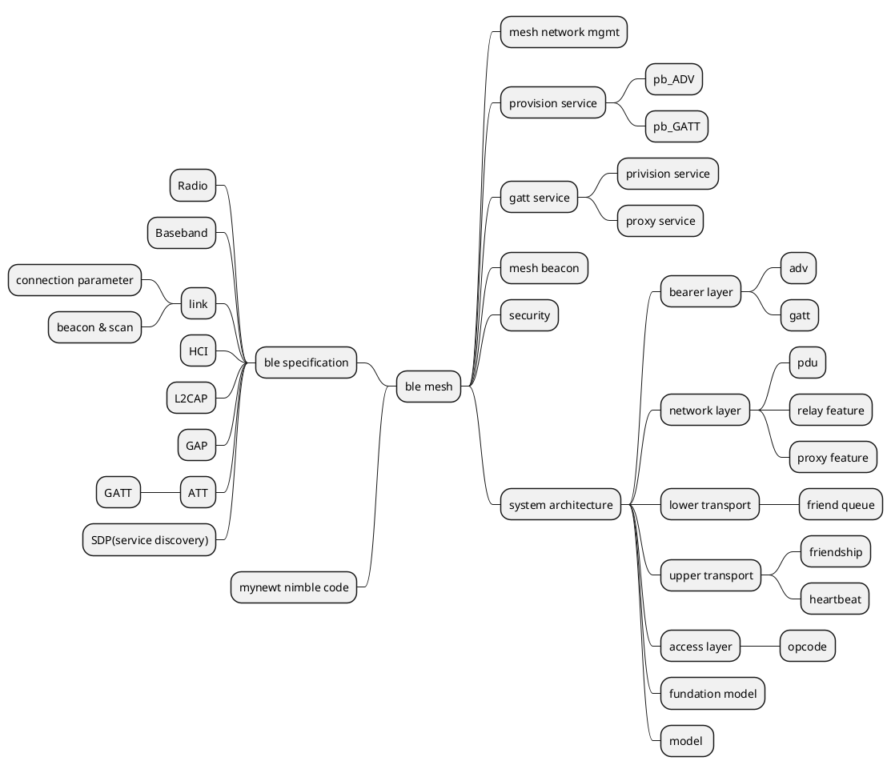

ble specification -> link layer
1. state machine, master/slave roles
2. device address 
    - Public Address:  MAC 
    - Random Address:  
        - static  : MSB 11 [not change during power cycle]
        - private : [change according T_GAP]
            - Resolvable     : MSB 01 , [hash = ah(IRK, prand), randomAddress = hash(3B) || prand(3B)]
            - Non-Resolvable : MSB 00,  when to use ?
3. 40 channels, access address used to detect frame collision.
4. air interface packet format. 
    Preamble(1B)  + Access Address(4B) + PDU(2~257B) + CRC(3B)    
    shortest frame: 10B
    longest  frame: 265B
    
    - Access Address for advertising channel: 0x8E89BED6
    - Data Channel base on connection: random value generated by initiator 

5. Advertising Channel PDU
    | PDU Type | RFU | TxAdd | RxAdd | Len | RFU | Payload |
    | --       |  -- | --    | --    | --  | --  | --      | 
    | 4b       | 2b | 1b | 1b | 6b | 2b | Payload |
    
    len: 6~37
    
    PDU Type:
    0000 ADV_IND   
        - payload: [AdvA(6B) + AdvData(0~31B)]  <TxAdd=0 AdvA is public addr;  TxAdd=1 AdvA is random addr>
    0001 ADV_DIRECT_IND
        - payload: [AdvA(6B) + InitA(6B)]  TxAdd is the same as ADV_IND, <RxAdd=0 InitA is public addr;  RxAdd=1 InitA is random addr>
                   no host data.
    0010 ADV_NONCONN_IND
        - payload: same as ADV_IND,  non-connectable undirect advertising.
    0110 ADC_SCAN_IND
        - payload: same as ADV_IND, scanable undirect advertising.
        
    0011 SCAN_REQ
        - payload: [ScanA(6B) + AdvA(6B)]
    0100 SCAN_RESP
        - payload: [AdvA(6B) + ScanRspData(0~31B)]
        
    0101 CONNECT_REQ 
        - payload : [InitA(6B) AdvA(6B) LLData(22B)]
            LL Data format:
            AA(4B)      : access address of the link 
            CRCInit(3B) : random , used in link CRC calc
            WinSize(1B) : transmitWindowSize = WinSize * 1.25 ms [sec 4.5.3]
            WinOffset(2B) : transmitWindowOffset = WinOffset * 1.25 ms
            Interval(2B) : connInterval = Interval * 1.25 ms [sec 4.5.1]
            Latency(2B)  : connSlaveLatency = Latency
            Timeout(2B)  : connSupervisionTimeout = Timeout * 10 ms
            ChM(5B)      : 
            Hop(5 bits)  : HopIncrement 5~16 [sec 4.5.8.2]
            SCA(3 bits)  : masterSCA used to determine the worst case Master’s sleep clock accuracy. [sec 4.2.2]
            

6. Data Channel PDU

